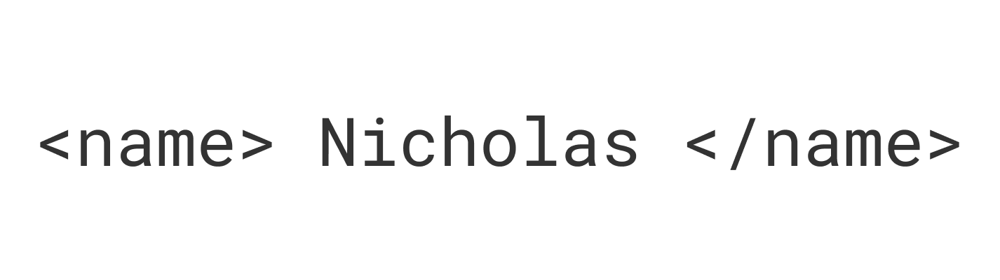

<p align="center">
  
</p>

<div align="center">

```
┌──────────────────────────────────────────────────────────────────┐
│                                                                  │
│  > whoami                                                        │
│  Nicholas Mamais                                                 │
│                                                                  │
│  > cat /etc/role                                                 │
│  Student & Intern                                                │
│                                                                  │
│  > cat /var/log/status                                           │
│  Building things that matter.                                    │
│  Learning — always.                                              │
│                                                                  │
└──────────────────────────────────────────────────────────────────┘
```

</div>

<div align="center">

```
╔══════════════════════════════════════════════════════════════════╗
║                        TOOLCHAIN                                ║
╚══════════════════════════════════════════════════════════════════╝
```

</div>

<p align="center">
  
</p>

<div align="center">

```
╔══════════════════════════════════════════════════════════════════╗
║                        ANALYTICS                                ║
╚══════════════════════════════════════════════════════════════════╝
```

</div>

<p align="center">
  
  &nbsp;&nbsp;
  
</p>

<p align="center">
  
</p>

<div align="center">

```
╔══════════════════════════════════════════════════════════════════╗
║                         CONNECT                                 ║
╚══════════════════════════════════════════════════════════════════╝
```

</div>

<p align="center">
  <a href="https://www.linkedin.com/in/nicholasmamais/">
    
  </a>
  <!--
  <a href="mailto:your@email.com">
    
  </a>
  <a href="https://your-portfolio.dev">
    
  </a>
  -->
</p>

<div align="center">

```
> echo $VIEWS
```


```
> exit 0
```

</div>
